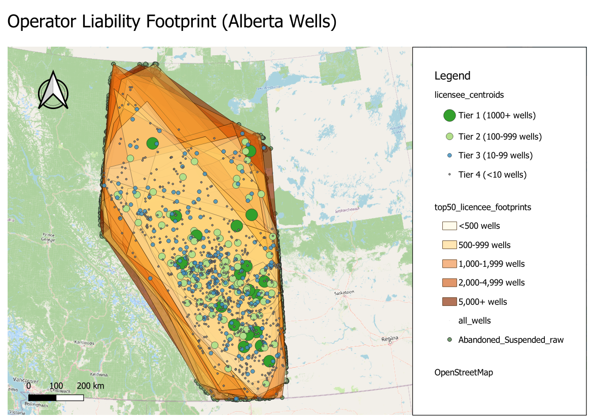

# Analysis 02 — Operator Liability Footprint

*Generated: 2026-04-30*

## 1. Objective
Map the **decommissioning liability footprint** of each licensee operating in
Alberta. For every company holding the licence on at least one
abandoned-or-suspended well, this analysis answers:
- How many wells does each licensee carry?
- Where are those wells geographically — concentrated in one play, or
  scattered across the province?
- Which licensees dominate the cleanup obligation?
- How concentrated is the market (HHI), and what's the long tail of small
  operators?

This is directly relevant to Alberta's orphan-well problem: when a small
licensee becomes insolvent, its wells can be transferred to the Orphan Well
Association, so understanding the *operator* dimension is as important as the
*spatial* dimension.

## 2. Input Data
| Item | Value |
|------|-------|
| Source dataset | `Abandoned_Suspended_raw.shp` |
| Source CRS | EPSG:4269 (NAD83 geographic) |
| Total wells | 94,428 (94,110 Abandoned + 318 Suspension) |
| Working CRS | EPSG:3400 (NAD83 / Alberta 10-TM Forest, metres) |
| Persisted as | `Input/all_wells.gpkg` |
| Key field | `Licensee` (operator name as registered with AER) |

Note: Analysis 01 filtered to `Status = Abandoned`; Analysis 02 deliberately
keeps **both** statuses because liability follows the licensee regardless of
whether a well is abandoned or merely suspended.

## 3. Methodology

### 3.1 Per-Licensee Aggregation
For each unique value of `Licensee`, the following were computed via PyQGIS:
- Total well count, with split into Abandoned / Suspension.
- Mean centroid (mean x and y of all the licensee's wells, in EPSG:3400).
- Bounding box extent (used to derive footprint diagonal length in km).
- Most common HQ city, province, and dominant fluid type.
- A coarse size-tier classification:

| Tier | Wells held |
|------|-----------|
| Tier 1 | 1,000+ |
| Tier 2 | 100 – 999 |
| Tier 3 | 10 – 99 |
| Tier 4 | < 10 |

### 3.2 Footprint Hulls
For the top 50 licensees (those holding ≥ ~500 wells; together accounting
for **74,268 / 94,428 wells = 78.6 %** of the total), a convex hull was
computed over their wells using `qgis:minimumboundinggeometry`. Each hull
carries `Wells`, `AreaKm2`, and `Density` (wells per km² inside the hull).

### 3.3 Market-Concentration Statistics
- **Herfindahl–Hirschman Index (HHI)** computed across all 952 licensees.
- **Top-10 / Top-25 share** of total wells.
- Distribution of licensees across size buckets.

## 4. Outputs
| File | Type | Contents |
|------|------|----------|
| `Input/all_wells.gpkg` | Vector (Point) | All 94,428 wells, EPSG:3400 |
| `Output/licensee_centroids.gpkg` | Vector (Point) | One centroid per licensee (952 features) with full attributes |
| `Output/top50_licensee_footprints.gpkg` | Vector (Polygon) | Convex hull per top-50 licensee with well count, area, density |
| `02_Operator_Liability_Footprint.qgz` | QGIS project | Pre-styled, ready to open |

## 5. Key Findings

### 5.1 Market structure
| Metric | Value |
|--------|-------|
| Unique licensees | **952** |
| Total wells | 94,428 |
| Top-10 licensees' share | **44.2%** of all wells |
| Top-25 licensees' share | **62.1%** |
| Herfindahl–Hirschman Index | **592** |

The HHI of 592 is well below the 1,500 threshold the U.S. DOJ
considers "moderately concentrated", so the Alberta abandoned-well market is
*formally* unconcentrated — but that's misleading: a single operator
(**Canadian Natural Resources Ltd.**) carries **22.0 %** of the entire
liability load by itself.

### 5.2 Licensee size distribution
| Tier | Licensees | Approx. share |
|------|----------:|--------------:|
| Tier 1 (1,000+ wells) | 19 | bear majority of liability |
| Tier 2 (100–999) | 96 | mid-size operators |
| Tier 3 (10–99) | 175 | smaller producers |
| Tier 4 (2–9) | 349 | small / niche operators |
| Single-well | 313 | **highest insolvency / orphan risk** |

The **313 single-well licensees** and **349 micro-operators** (≤10 wells) are
the population most likely to default and dump wells into the Orphan Well
Association programme.

### 5.3 Top 25 licensees
| Rank | Licensee | Wells | % of total | Abandoned | Suspended | HQ |
|-----:|:---------|------:|-----------:|----------:|----------:|:---|
| 1 | Canadian Natural Resources Limited | 20,769 | 21.99% | 20,696 | 73 | Calgary, AB |
| 2 | Cenovus Energy Inc. | 5,874 | 6.22% | 5,854 | 20 | Calgary, AB |
| 3 | Torxen Energy Ltd. | 2,300 | 2.44% | 2,292 | 8 | Calgary, AB |
| 4 | Harvest Operations Corp. | 2,067 | 2.19% | 2,065 | 2 | Calgary, AB |
| 5 | Suncor Energy Inc. | 2,060 | 2.18% | 2,059 | 1 | Calgary, AB |
| 6 | Paramount Resources Ltd. | 1,961 | 2.08% | 1,951 | 10 | Calgary, AB |
| 7 | Ipc Canada Ltd. | 1,777 | 1.88% | 1,777 | 0 | Calgary, AB |
| 8 | Obsidian Energy Ltd. | 1,729 | 1.83% | 1,729 | 0 | Calgary, AB |
| 9 | Imperial Oil Resources Limited | 1,699 | 1.80% | 1,684 | 15 | Calgary, AB |
| 10 | Pine Cliff Energy Ltd. | 1,526 | 1.62% | 1,525 | 1 | Calgary, AB |
| 11 | Surge Energy Inc. | 1,509 | 1.60% | 1,508 | 1 | Calgary, AB |
| 12 | AlphaBow Energy Ltd. | 1,490 | 1.58% | 1,488 | 2 | Calgary, AB |
| 13 | Canlin Energy Corporation | 1,376 | 1.46% | 1,373 | 3 | Calgary, AB |
| 14 | Tourmaline Oil Corp. | 1,331 | 1.41% | 1,325 | 6 | Calgary, AB |
| 15 | West Lake Energy Corp. | 1,130 | 1.20% | 1,126 | 4 | Calgary, AB |
| 16 | City Of Medicine Hat | 1,109 | 1.17% | 1,108 | 1 | Medicine Hat, AB |
| 17 | SanLing Energy Ltd. | 1,105 | 1.17% | 1,104 | 1 | Calgary, AB |
| 18 | Long Run Exploration Ltd. | 1,077 | 1.14% | 1,072 | 5 | Calgary, AB |
| 19 | Ember Resources Inc. | 1,051 | 1.11% | 1,051 | 0 | Calgary, AB |
| 20 | Baytex Energy Ltd. | 999 | 1.06% | 988 | 11 | Calgary, AB |
| 21 | Blue Sky Resources Ltd. | 983 | 1.04% | 981 | 2 | Calgary, AB |
| 22 | Prairie Provident Resources Canada Ltd. | 977 | 1.03% | 970 | 7 | Calgary, AB |
| 23 | ConocoPhillips Canada Resources Corp. | 924 | 0.98% | 922 | 2 | Calgary, AB |
| 24 | Syncrude Canada Ltd. | 919 | 0.97% | 919 | 0 | Calgary, AB |
| 25 | TAQA North Ltd. | 898 | 0.95% | 897 | 1 | Calgary, AB |

### 5.4 HQ geography
- **Calgary**: HQ for **717 of 952 licensees** (~75 %).
- **Edmonton**: 30 licensees.
- Out-of-province HQ: **44 licensees** (Vancouver, Toronto and elsewhere).

### 5.5 Concentrated vs. scattered operators
By comparing centroid-bounding-box diagonals among top licensees:
- **Province-wide operators** (>1,000 km diagonal): CNRL, Cenovus, Harvest,
  Suncor, Paramount, IPC Canada, Obsidian, Imperial. These hold portfolios
  spanning the whole western sedimentary basin — diversified plays but harder
  cleanup logistics.
- **Single-play operators** (<300 km diagonal): **Torxen Energy** (195 km
  diagonal, 2,300 wells) is the standout — a highly concentrated portfolio.
  The City of Medicine Hat (1,109 wells in its municipal gas field) is
  another by definition.

### 5.6 Implication for orphan-well risk
The hotspot map from Analysis 01 plus the licensee map here together identify
where regulators should monitor most closely: clusters within the Lloydminster
heavy-oil belt and the Athabasca region are dominated by **CNRL**, **Cenovus**
and **Suncor** — large, well-capitalised players with low insolvency risk.
Smaller mid-tier and single-play operators with portfolios concentrated in
older conventional plays (e.g., east-central Alberta) are the more exposed
segment.

## 6. How to Reproduce
1. Open `02_Operator_Liability_Footprint.qgz` in QGIS 3.x.
2. Three layers should load with their pre-set styling:
   - All wells (faint grey base)
   - Top-50 operator footprints (graduated by well count)
   - Licensee centroids (sized & coloured by Tier)
3. Use *Identify Features* on the centroid layer for licensee details, or
   open the attribute table to sort by `Wells`, `Density`, etc.

## 7. Notes & Caveats
- A licensee here is identified purely by string match on the `Licensee` field.
  Corporate name changes, mergers, and asset transfers are *not* normalised —
  e.g., wells transferred from Husky to Cenovus may still appear under the
  original licensee depending on whether AER records were updated.
- Convex hulls overstate the true operating footprint when wells are not
  uniformly distributed within the bounding shape. Concave hulls (alpha
  shapes) would tighten this if needed.
- HHI uses well-count share, not revenue or production volume; market power
  in *production* is not what is measured here. Liability share is.
- Suspension wells (n=318) are included for completeness but are a small
  proportion of the dataset and don't materially shift any rankings.

---

## Map Preview

